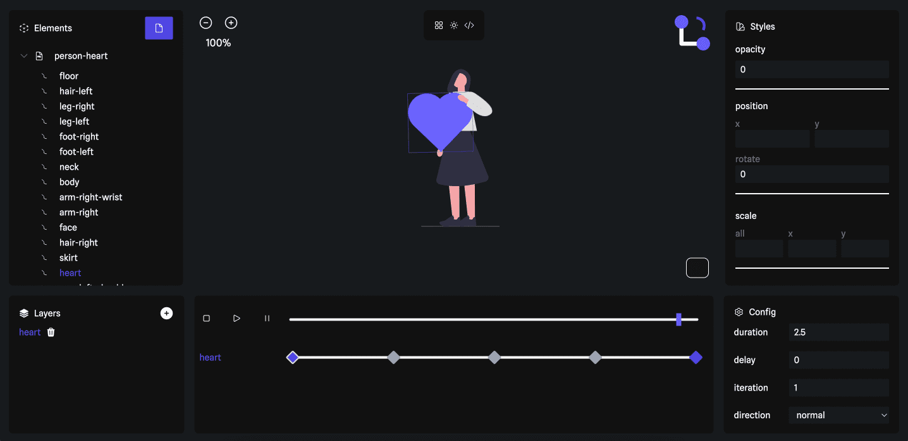

# No Code SVG Animation

Early development tool to animate svgs and export animations as CSS or JavaScript animations

## 🛠 Project Tech

- [react](https://react.dev)
- [tailwindcss](https://tailwindcss.com)
- [headlessui](https://headlessui.com)
- [heroicons](https://heroicons.com)

## 🧞 Commands

All commands are run from the root of the project, from a terminal:

| Command                | Action                                  |
| :--------------------- | :-------------------------------------- |
| `npm install`          | Installs dependencies                   |
| `npm run dev`          | Starts local dev server                 |
| `npm run build`        | Build your production site to `./dist/` |
| `npm run format`       | Format code check                       |
| `npm run format:fix`   | Fix code formatting issues              |
| `npm run cypress:open` | Run cypress with UI                     |
| `npm run cypress:run`  | Run cypress headless                    |
